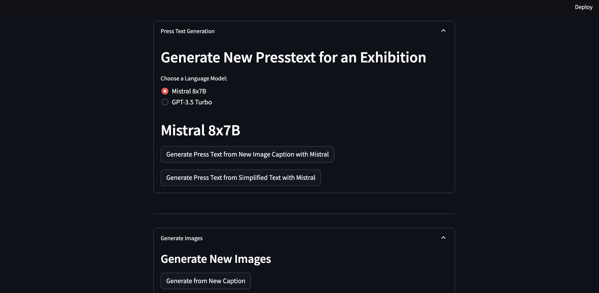
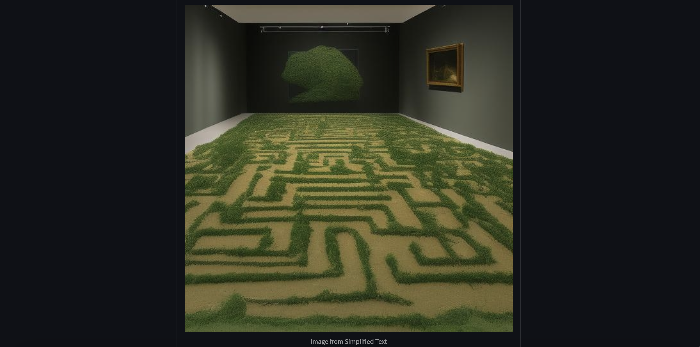

+++
metaDescription = "We used the Hugging Face Inference API and the Open AI API to create an app that simplifies artspeak and generates new press texts and images."
date = "2023-12-16T12:00:00-00:00"
+++

### AI Meets ArtSpeak:  
##### Simplifying Contemporary Art Texts and generating new Art and Texts
  

#### Introduction

This project investigates International Art English (IAE), a distinctive form of English prevalent in the contemporary art sphere, characterized by its specialized vocabulary and complex structures. It has spurred considerable debate about its accessibility and impact on art communication. We've developed a Streamlit application that adopts a playful and humorous approach to this subject matter. Users are invited to upload press texts and images from contemporary art exhibitions, and the application "simplifies" these into concise sentences. These simplified versions are then used to generate new, elaborate press texts in authentic IAE style. Additionally, the app creates four unique contemporary art images based on these simplifications and the newly formed texts. This development, achieved within a very limited timeframe, leverages the remarkable capabilities of HuggingFace and OpenAI APIs.

#### What is the Hugging Face Inference API?

The [Hugging Face Inference API](https://huggingface.co/docs/api-inference/index) provides a versatile way to deploy machine learning models quickly and effectively, bypassing the need to establish a machine learning environment from the ground up. It serves as a conduit, enabling users to interact with pre-trained models hosted on Hugging Face via simple HTTP requests. The API facilitates fast prototyping, offering access to a variety of models, and is user-friendly. It empowers developers to rapidly prototype AI-based applications by providing access to a wide array of pre-trained models. This is especially beneficial for startups or projects with tight deadlines that need to showcase capabilities without significant initial investment. The API offers models for a variety of tasks including text classification, question answering, sentiment analysis, summarization, translation, and more, making it a versatile tool for many applications in Natural Language Processing and computer vision. It simplifies the complexities involved in deploying machine learning models, allowing users to focus on integrating these models' capabilities into their applications. The first step is selecting a model from the Model Hub, with recommended models available for each task.

#### What models did we use?

For our project, we utilized the following models:

- [BLIP for image captioning](https://huggingface.co/Salesforce/blip-image-captioning-base): A model developed by Salesforce that integrates computer vision and NLP. Of note, while not available via the inference API, we experimented with CoCa ([OpenClip Contrastive Captioners (CoCa)](https://github.com/robgon-art/open-clip)) and found it provided superior results for our specific task.
- A [fine-tuned T5 model](https://huggingface.co/mrm8488/t5-small-finetuned-text-simplification) for text simplification: Available via the inference API, this model is designed for producing short, precise summaries (for us sometimes with a humorous twist) aligning with our project's playful objectives. It often outperformed models fine-tuned for summarization for our specific goals, although occasionally it did not fully meet our expectations. This realization highlighted the benefits of prototyping with the Hugging Face API and the potential advantages of fine-tuning a model to fit our specific needs.
- To generate new press texts, users can choose between [Mixtral 8x7B](https://huggingface.co/mistralai/Mixtral-8x7B-Instruct-v0.1) and [GPT-3.5 Turbo](https://platform.openai.com/docs/introduction). These large language models are prompted to create detailed new press texts, contextualizing the art in societal topics using the short summaries from the text and image. While GPT requires an API key from the user (to pay for the tokens), Mistral is available free via the inference API. We included both to compare their performance on this task. Mistral 8x7B stands out as an exceptional open-weights model, offering performance comparable to or surpassing that of GPT-3.5 and Llama 2 70B on most benchmarks, while offering faster inference.
- For image generation, we used [Stable Diffusion v1-4 from CompVis](https://huggingface.co/CompVis/stable-diffusion-v1-4), a latent text-to-image diffusion model capable of generating photo-realistic images based on any text input.

#### Could it have been even simpler and quicker?

While using the OpenAI API for all tasks (except Image Captioning, since GPT4-Vision API was only accessible to limit group of users at the time when the article was written) might have simplified the process, our goal was to explore the vast possibilities of the Hugging Face API and create a completely free version. Embracing the complexity of various models, instead of relying solely on OpenAI’s API, not only mirrored the intricate nature of artspeak but also added a rich layer of diversity to our project’s technical canvas.

 
#### Summary

The Hugging Face Inference API democratizes access to powerful machine learning models, allowing a broader range of developers and businesses to incorporate advanced AI capabilities into their applications with minimal setup and maintenance effort. Whether for image captioning and generation, content summarization, or any other task, the API provides a straightforward, flexible, and efficient solution to leverage state-of-the-art models. Our application is a testament to the power and versatility of the Hugging Face and OpenAI APIs, and we invite you to try out the [app on Hugging Face Spaces](https://huggingface.co/spaces/coztomate/artspeak) or visit our [GitHub page](https://github.com/coztomate/Artspeak_Simplifier) for more details.

