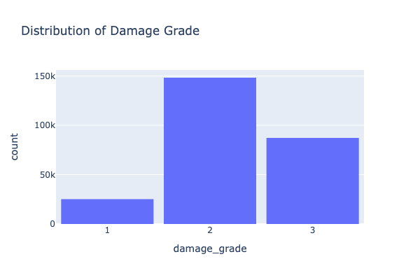
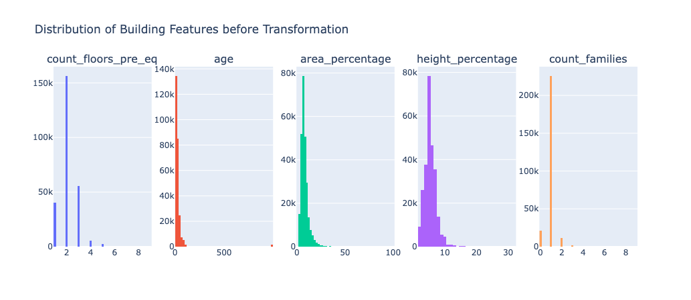
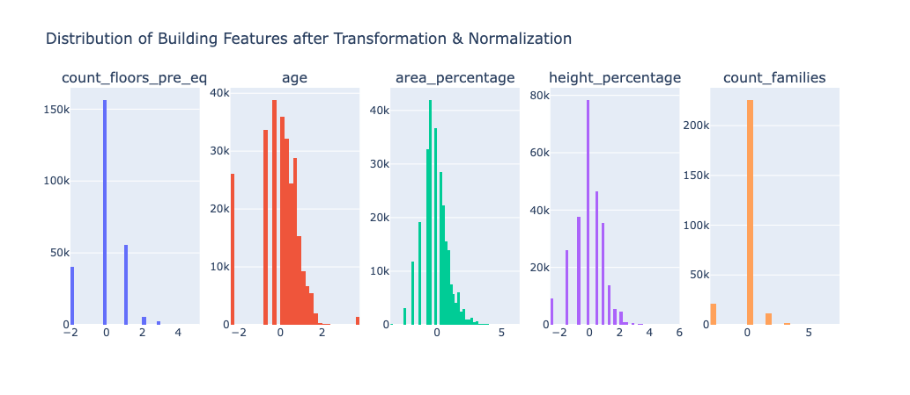
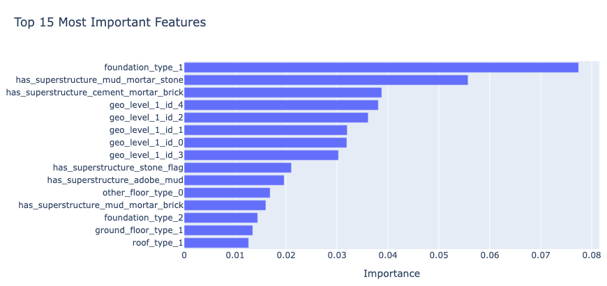

+++
date = "2023-10-31T12:00:00-00:00"
+++

### Machine Learning from Destruction: 
##### The “Richter's Predictor: Modeling Earthquake Damage“ competition 
  

#### Introduction

Engagement in Data Science competitions serves as an effective way to practice analytical competencies, offering exposure to competitive scenarios and an opportunity for skill benchmarking within the community. Driven Data hosts targeted data science competitions with social impact themes, contrasting with Kaggle's broader scope. For our data science curriculum, we formed a three-member team to enter such a competition, facing both internal academic and extensive global competition. This initial foray into data science was constrained by a three-day completion deadline. Despite these constraints, our project was very successful. Our model outperformed our academic peers and placed within the top 5 % of global entries (354th out of 6577, 5.4%, October 2023). The article aims to detail our methodology, outline critical insights, and identify the successful strategies.

#### Problem Description

The "Richter's Predictor: Modeling Earthquake Damage" competition on Driven Data focused on analyzing the 2015 Gorkha earthquake's impact in Nepal. Competitors used building data to predict damage levels, employing a dataset from Kathmandu Living Labs and the Central Bureau of Statistics, which included post-disaster effects, household conditions, and socio-economic data for government aid and census purposes.

The challenge involved using machine learning to estimate the 'damage_grade'—an ordinal variable with three levels: low, moderate, and severe destruction. The analysis aids in developing models that predict building damage during earthquakes. The goal is to inform the design of buildings that can withstand seismic events better and to enhance community readiness for such disasters.

#### Benchmark

In data competitions, establishing a baseline model is essential. We used the given benchmark model based on a Random Forest algorithm from the competition's website. The primary metric for evaluation was the F1 micro score, which combines precision and recall, suitable for our multi-class classification problem with three labels.

The standard F1 score is typically for binary classifications, but here, the micro-averaged version was appropriate. The provided benchmark model achieved an F1 score of 0.5815, setting the initial standard for our subsequent model development efforts.

#### Data Exploration
The dataset primarily encompasses detailed information concerning the structural attributes, geographical positioning, and legal ownership of the affected buildings. Each entry in the dataset corresponds to a specific building within the region impacted by the Gorkha earthquake, with a total of 39 columns, including a unique identifier 'building_id' assigned to each building.
 
Exploring the outcome variable, we immediately noted a significant class imbalance, with a mere 10% of entries falling into category one, 33% in category three, and the predominant majority of 57% falling into category two.
 
To ensure data integrity, we conducted checks for missing values and duplicate entries, resulting in no instances of missing data or duplicated records within the dataset.
 
However, a notable challenge arose from the presence of numerous categorical features and skewed dimensional attributes within the dataset, necessitating a comprehensive approach to address these complexities.

 
#### Encoding
Directly modeling categorical variables with multiple non-ordinal categories is impractical due to the complexity of translating these categories into numerical values. Most machine learning algorithms require numerical inputs, hence necessitating the conversion of string-based categorical data.

Out of the 38 features, the bulk were categorical, with some pre-encoded for secondary building uses and superstructure types. For multi-category features, we needed an encoding strategy that acknowledged the non-ordinal category nature.

Geographic data were coded in three 'geolevel' variables, indicating location specificity. 'Geolevel 1' was the most general, 'Geolevel 2' more specific, and 'Geolevel 3' had 11,595 unique codes, similar to a postal code system. Traditional one-hot encoding was impractical due to the high dimensionality it would introduce.

We applied BinaryEncoder for its efficiency in handling high-cardinality features. It encodes categories as integers, then into binary, and distributes these across columns, capping the number of new columns to the log2 of unique category counts. This approach effectively managed the geographic data within 14 columns, demonstrating BinaryEncoder's suitability for high-cardinality categorical data.

#### Normalization and Transformation
Dimensional numeric features such as the number of floors, age of buildings, area, height percentage, and family count showed a pronounced right skew in their distribution. To counteract this and aim for normal distribution, we used a log transformation with an added one to address zero values. This step helped normalize the data and lessen the effect of outliers, enhancing the model's stability.

We also standardized the data using StandardScaler, adjusting features to a mean of zero and a standard deviation of one. This equality in scale is crucial for models where feature magnitude can disproportionately influence the outcome. For our tree-based models, though, the scale insensitivity meant that StandardScaler's impact was minor, but it was nonetheless implemented for consistency and compatibility with other algorithms sensitive to feature scale.

 
#### Hyperparameter-Tuning
We selected XGBoost, a robust gradient boosting algorithm known for its scalability and efficiency in handling large datasets, to surpass our initial benchmark model. Hyperparameter tuning plays a critical role in optimizing XGBoost's performance and preventing overfitting. Optuna, an efficient hyperparameter optimization framework, automates the search for the best parameter configuration, streamlining the process and enhancing the model's predictive capabilities. 
 
Following Optuna's recommendations, we achieved an impressive F1 score of 0.74803 on our cross-validation set. To further enhance the model's learning capacity, we retrained the model with the same optimal parameters using the complete raw training dataset provided by the competition. Subsequently, we utilized this trained model to generate predictions for the provided test data. 

The submission phase was notably exhilarating, as it marked the moment of truth for our model's performance. To our delight, our submission yielded an outstanding F1 score of 0.7493, surpassing our cross-validation score and securing a position within the top 5 percent, a gratifying accomplishment for our team.

#### What else did we try? 
To tackle high cardinality in categorical features, we also tried to employ mean encoding, replacing categories with the average target value. This method leverages target information, improving pattern recognition within the data. Additionally, we addressed the class imbalance problem by experimenting with SMOTE, which synthesizes new instances of the minority class. However, both approaches did not improve the F1 score.

We also analyzed feature importance, identifying and retaining only influential features. This refined the model by focusing on predictors crucial for the target variable, thereby boosting efficiency and interpretability. However, this also led to no improvement in our F1 score. However, it gave us some insight in what might have been important features for our model.

#### Exploring Feature Importance
A notable feature of random forest classifier models, including XGBoost, is the ability to extract insights into feature importance for making predictions. Our analysis showed that the foundation type emerged as the most important predictor. However, due to the simple letter encoding ('r,' 'w,' 'i,' 'u,' 'h') employed for these variables, we cannot draw conclusions from it.
Among the other significant predictors, the type of superstructure, including mud, mortar, stone, and cement, as well as the composition of mortar and brick, also emerged as influential features. Additionally, the geographic location represented by the geo-level id played a pivotal role in the model's predictive accuracy, suggesting that buildings located in close proximity to the earthquake's epicenter were more susceptible to significant damage.

#### Conclusion: What did we take away?
 
To summarize the process: our initial submission with binary encoding and optimized XGBoost using Optuna achieved an F1 score of 0.7456. While alternative encoding methods did not significantly improve scores, they emphasized the need for tailored strategies, especially for variables like geo-location.
 
Retraining the model with optimized hyperparameters on the complete dataset raised our F1 score to 0.7472, further improved to 0.7491 after normalization and applying Optuna again. These marginal improvements were in line with our expectations as mentioned above.
 
Our streamlined team workflow, coupled with tailored encoding techniques for high cardinality categorical data, and the use of advanced optimization methods like XGBoost with Optuna, enabled the development of an accurate predictive model for post-earthquake building damage assessment. Our journey underscores the importance of a systematic and adaptive approach in addressing complex data science challenges within strict time constraints.

[See on Github](https://github.com/coztomate/Earthquake_Damage)

