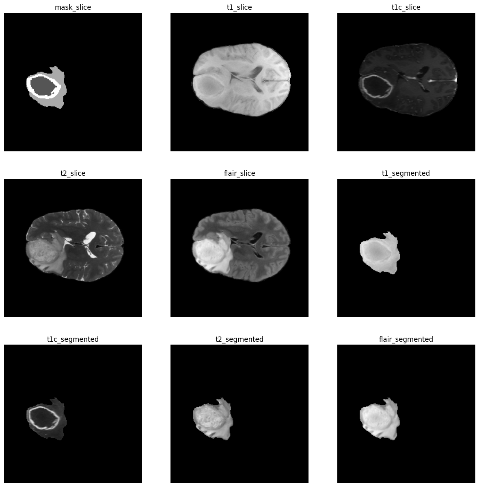
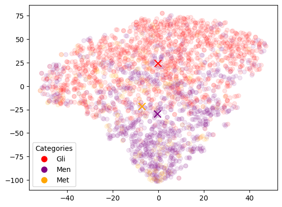
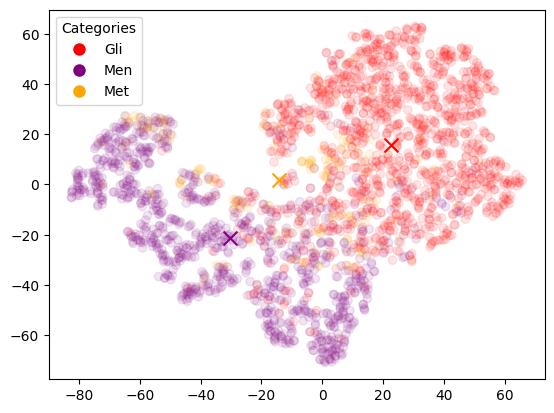
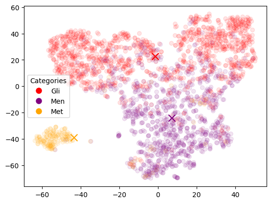
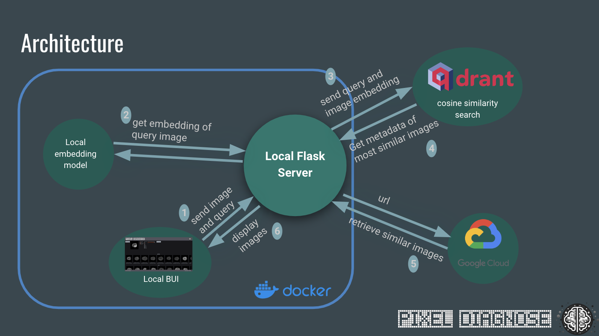

+++
metaDescription = "Similarity search for brain tumor MRI scans based on qdrant vector store and Google cloud after transfer learning and constructing CNNs with triplet loss"
date = "2024-01-09T12:00:00-00:00"
+++

### Pixel Diagnose: 
##### Enhancing Brain Tumor Diagnosis through Similarity Search
  

#### Motivation

Radiologists are faced with critical decisions daily. When examining an MRI image, they must discern whether a visible anomaly, such as a spot, indicates the presence of a tumor, and if so, its type. A traditional approach involves comparing the image in question with others from textbooks, personal archives or existing databases that contain images of various tumor diagnoses. These databases, often publicly accessible, host thousands of images from tumor patients. However, the challenge lies in the human capacity to analyze a limited number of images and to efficiently identify the most relevant comparisons.

Our machine learning model enhances this process with AI. It enables a radiologist’s MRI to be cross-referenced against thousands of patient images in mere seconds, pinpointing the most similar cases across diverse diagnoses. This is achieved through the generation of vector embeddings from the extensive image repository, all stored in a specialized vector database. The model then performs a similarity search to identify the closest matches to the query image for various diagnoses. While our prototype primarily addresses brain tumors, the underlying methodology is versatile and can be adapted for other tumor types. This approach not only increases efficiency but also enhances the accuracy of diagnosis, leveraging the power of AI to assist in crucial medical decision-making.

This clip shows how the app works:


## Data Acquisition and Processing
Our project began with the retrieval of online datasets comprising brain tumor patient images, necessitating extraction and preprocessing from extensive databases. Numerous databases exist for tumor imagery, including those beyond brain tumors (see [The Cancer Imaging Archive](https://www.cancerimagingarchive.net/)). For our initial prototype, we focused on what we believe to be the largest brain tumor dataset available: the International Brain Tumor Segmentation (BraTS) challenge dataset ([BraTS Challenge](https://www.synapse.org/#!Synapse:syn51156910/wiki/)), which contains approximately 4,500 images of gliomas, meningiomas, and metastases. These images are derived from routine, clinically-acquired, multi-site multiparametric magnetic resonance imaging (mpMRI) scans. Each dataset has been meticulously annotated by one to four raters, adhering to a unified protocol and validated by experienced neuroradiologists. 

To manage this considerable data volume, we used Google Cloud Storage. Google Colab, known for its seamless integration with Google Cloud and its provision of GPU resources in the free tier, was our primary tool for image preprocessing, model development, and vector store creation. For more resource-intensive tasks, we employed Colab Enterprise, offering a collaborative, managed notebook environment within the secure and compliant infrastructure of Google Cloud.

MRI scan files present unique challenges as they are not standard 2D images but rather 3D representations with an additional dimension of modality. These modalities include a) native (T1), b) post-contrast T1-weighted (T1Gd), c) T2-weighted (T2), and d) T2 Fluid Attenuated Inversion Recovery (T2-FLAIR). The BraTS scans are provided in NIfTI format (.nii.gz), a prevalent format in MRI imaging. For each patient, the dataset includes a 3D segmentation mask of the tumor in NIfTI format. We employed the ‘nibabel’ Python library to read and transform these files into numpy arrays. Our initial approach involved creating embeddings from the slice of the 3D image that depicted the largest section of the tumor. We extracted this specific slice in two variants: one showcasing the entire slice and another displaying only the segmented tumor with and without a boxed cut-out. This dual approach was adopted to determine which method would yield the most effective results for our similarity search.

Extracted Slices from MRI Scans:

## Model Selection, Exploration, and Evaluation in Pixel Diagnose

In the context of our project, 'similarity' is a multifaceted concept, encompassing aspects such as tumor size, location, and shape. Our primary objective extended beyond merely classifying the type of tumor in the query image or identifying the most similar images. We aimed to present a diverse range of images for each diagnosis. To achieve this, we wanted vector embeddings for the same diagnoses clustered closely in the latent vector space. For a more interpretable analysis, we utilized t-SNE for dimension reduction, aiding in the visual representation and evaluation of our model embeddings (refer to accompanying images).

Our initial phase involved experimenting with ImageNet-pretrained CNNs, RESNet50, and RESNet152. While these models are adept at recognizing a wide range of everyday objects, they fell short in detecting the subtle differences crucial in neuroimaging, often generalizing all brain scans. This led us to experiment with MedCLIP, a medically adapted version of OpenAI's CLIP model. Despite its focus on medical imaging, MedCLIP did not significantly outperform the traditional models, a challenge we attributed to our specific concentration on brain tumors.

Seeking greater specificity, we turned to EfficientNetV2, known for its parameter efficiency and swift training capabilities. When used for transfer learning and feature extraction in classifying three types of brain cancer, it yielded promising results. Nonetheless, our most significant advancement was achieved through the development of a custom CNN using triplet loss. This approach, which emphasizes comparing similar and dissimilar inputs, facilitated the creation of embeddings that most accurately represented tumor characteristics. The effectiveness of this method was evident as the embeddings from the second-to-last layer of the model clustered according to diagnosis in the latent space.

This journey underscored a critical aspect of similarity search in medical imaging: the potential for bias towards diagnosis-specific features at the expense of other relevant visual similarities. By training models to differentiate between tumor types, we risked neglecting other significant similarities not directly related to classification. Consequently, our evaluation process was comprehensive, incorporating in-depth visual inspection of results and collaboration with medical experts to ensure the model's clinical relevance and utility.

RESNet-50 Embeddings:

EfficientNetV2 Transfer Learning Embeddings:

CNN with Triplet Loss Embeddings:

## Implementation and Deployment

Our selected model was employed to generate vector embeddings, which we stored in our Qdrant vector database. The similarity search is initiated when users upload their query images through a browser-based user interface (BUI). This interface forwards the images to a Flask server, which acts as the central coordinator in this architecture. The Flask server interfaces with a local embedding model (running on CPU) to compute vector embeddings for the query images. These embeddings are then transmitted to the Qdrant service. Qdrant utilizes cosine similarity algorithms, adept at identifying images whose embeddings are most similar to those of the query. Once identified, Qdrant returns the metadata of these closely matching images to the Flask server, which then retrieves the corresponding images from Google Cloud Storage and displays them to the user via the BUI.

To ensure our system's scalability and ease of deployment, we have containerized it using Docker. This approach allows for efficient management of the various components of our system, including the BUI, Flask server, embedding model, and the Qdrant service. The containerization also aids in maintaining consistency across different computing environments, making our system robust and adaptable to various deployment scenarios. 

Overview of Architecture:

 

## Future Outlook: Expanding Horizons and Refining Techniques

Our ongoing evaluations include assessing various image types and model comparisons, complemented by consultations with radiologists to align with their clinical needs. Enhancements like transitioning from 2D to 3D imaging and expanding our dataset will enable more robust training and precise outcomes. We're also exploring beyond our current CNN with triplet loss, mindful of potential biases. Continuous refinement, layer exploration, and integrating brain extraction and tumor segmentation tools are critical for accuracy and relevance. Future plans also involve expanding our application to cover all organ imaging and introducing 3D brain views, aiming to offer a comprehensive diagnostic tool for medical imaging. These steps signify our commitment to advancing medical imaging technology and improving patient care.

## Summary

Through the creation of Pixel Diagnose, we've showcased the potential of AI in enhancing medical diagnostics. Our exploration highlighted the limitations of traditional image recognition models in discerning the complexities of medical imaging, leading to the development of a specialized CNN with triplet loss. The result is an intuitive, browser-based application adept at processing brain tumor images, offering radiologists a robust tool for precise diagnosis. However, this is just the beginning. The application's framework holds the promise of expansion to various image types and tumor classifications. For a deeper dive into our innovative approach and to experience the technology firsthand, visit our [GitHub repository](https://github.com/pixel-diagnose) and try our [Docker Demo](https://hub.docker.com/r/mkstatistics/pixel-diagnose-demo).

